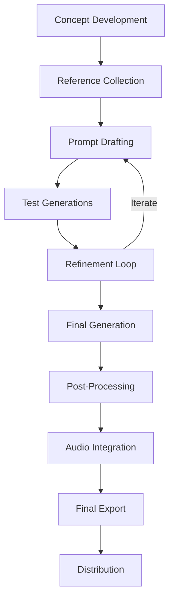

# Basic Video Generation Workflow

This guide outlines a complete end-to-end workflow for creating AI-generated videos, from concept to final delivery. The workflow is designed to be tool-agnostic but includes specific tips for popular platforms.

## Overview of the Workflow



---

## 1. Concept Development

### A. Define Your Goal

Start by clearly defining what you want to achieve:

- **Purpose:** What is this video for? (Social media, concept visualization, art project)
- **Length:** How long does it need to be? (Most tools generate 2-4 seconds, plan accordingly)
- **Style:** What visual style are you aiming for?
- **Content:** What should appear in the video?
- **Audience:** Who will watch this video?

### B. Create a Simple Storyboard

Even a rough storyboard helps visualize your concept:

- Sketch basic frames showing key moments
- Note camera movements and transitions
- Consider the narrative flow (beginning, middle, end)
- Plan how separate clips might be combined later

### C. Technical Planning

Determine technical specifications based on your needs:

- **Resolution:** Target resolution (480p, 720p, 1080p)
- **Aspect Ratio:** Standard (16:9), vertical (9:16), square (1:1)
- **Frame Rate:** Typically 24-30fps
- **Length:** Plan for multiple short clips that can be combined
- **Output Format:** MP4, GIF, etc.

---

## 2. Reference Collection

### A. Visual References

Gather references to clarify your vision:

- **Style References:** Find images/videos with the desired aesthetic
- **Subject References:** Collect images of similar subjects/characters
- **Motion References:** Find videos with similar movements
- **Mood Board:** Create a collection of inspiration images

### B. Technical References

Collect examples demonstrating technical aspects:

- **Lighting:** Examples of desired lighting style
- **Camera Work:** Videos showing similar camera movements
- **Color Grading:** Examples of color treatment you like

### C. Organize References

Create a structured system for your references:

- Use folders or a tool like Pinterest/Miro
- Group references by category (style, subject, motion)
- Note specific elements you like about each reference

---

## 3. Prompt Development

### A. Draft Initial Prompts

Create your first prompt drafts:

1. Start with a basic description of what you want to see
2. Add style references and technical specifications
3. Include camera movement and action descriptions
4. Note any specific details that are crucial

### B. Structure Your Prompts

Follow a consistent structure:

```
[Style] [Subject] [Action] [Setting] [Atmosphere] [Camera Movement] [Technical Specifications]
```

Example:
```
Cinematic 8K footage of a red fox running through a snowy forest at dawn, volumetric lighting through trees, slow-motion tracking shot, shallow depth of field, shot on RED camera
```

### C. Prompt Variations

Prepare multiple prompt variations:

- Create 3-5 variations with different emphasis or wording
- Try different levels of specificity
- Experiment with different reference combinations

---

## 4. Test Generations

### A. Initial Tests

Run small-scale tests to find what works:

- Generate short clips with each prompt variation
- Use lower resolution/quality settings for faster iteration
- Test on a single frame first if the platform allows
- Randomize seeds to see variety of results

### B. Systematic Testing

Create a methodical approach to testing:

| Test # | Prompt | Seed (if fixed) | Settings | Results | Notes |
|--------|--------|-----------------|----------|---------|-------|
| 1 | [Prompt 1] | [Seed] | [Settings] | [Link] | [Observations] |
| 2 | [Prompt 2] | [Seed] | [Settings] | [Link] | [Observations] |
| 3 | [Prompt 1 + Modification] | [Seed] | [Settings] | [Link] | [Observations] |

### C. Evaluation

Assess your test results objectively:

- **Prompt Alignment:** Does it match what you described?
- **Quality:** Is the visual quality acceptable?
- **Temporal Consistency:** Does it maintain consistency over time?
- **Subject Clarity:** Is the subject clear and well-formed?
- **Motion Quality:** Does the motion look natural and appropriate?

---

## 5. Refinement Loop

### A. Analyze Results

Study your test generations to identify patterns:

- Note what worked well in specific prompts
- Identify common issues or artifacts
- Look for unexpected but interesting results
- Compare against your original vision

### B. Prompt Refinement

Improve your prompts based on analysis:

- Add more detail in areas that need improvement
- Remove or modify elements that caused problems
- Add negative prompts to avoid specific issues
- Emphasize elements that worked well

### C. Setting Adjustments

Experiment with generation settings:

- **Guidance Scale/CFG Scale:** Adjust how closely it follows the prompt
- **Temperature/Randomness:** Control creativity vs. predictability
- **Seed:** Fix the seed if you found a good starting point
- **Steps:** Increase for higher quality (if applicable)

### D. Iterative Testing

Continue testing in an organized way:

- Make one change at a time to isolate effects
- Keep detailed notes about each change and result
- Save all tests with clear naming conventions
- Recognize when you're getting diminishing returns

---

## 6. Final Generation

### A. Preparation

Set up for your final generation:

- Review your best test results
- Finalize your prompt(s)
- Optimize settings for highest quality
- Ensure you have necessary credits/compute resources
- Prepare to save outputs at full quality

### B. Generation Strategy

For longer videos, plan your generation strategy:

- **Sequential Clips:** Generate multiple clips that will be joined
- **Scene Variations:** Generate multiple versions of key scenes
- **Components:** Generate elements that will be composited
- **Iterations:** Generate multiple variations of the same prompt

### C. Generation Process

Execute your final generation:

- Use maximum quality settings
- Generate at target resolution or higher
- Save all metadata (prompts, seeds, settings)
- Download in highest quality format available
- Generate safety copies with slight variations

---

## 7. Post-Processing

### A. Basic Enhancements

Perform initial post-processing as needed:

- **Color Correction:** Adjust brightness, contrast, saturation
- **Stabilization:** Fix any camera shakiness
- **Denoising:** Remove any visual artifacts
- **Frame Interpolation:** Increase smoothness/frame rate if needed
- **Upscaling:** Increase resolution if needed

### B. Advanced Editing

Consider more advanced editing techniques:

- **Compositing:** Combine different generated elements
- **Extending:** Loop or extend clips for longer duration
- **Transitions:** Add transitions between generated segments
- **Effects:** Add VFX elements to enhance the video
- **Text/Graphics:** Add captions, titles, or graphic elements

### C. Recommended Tools

Free and paid options for post-processing:

- **Basic:** DaVinci Resolve (free), Premiere Pro, Final Cut Pro
- **Enhancing:** Topaz Video AI, VEAI, or online enhancement services
- **Compositing:** After Effects, Fusion, Nuke
- **Quick Editing:** CapCut, Premiere Rush, iMovie

---

## 8. Audio Integration

### A. Audio Planning

Consider your audio approach:

- **Music:** Background music/soundtrack
- **Sound Effects:** Ambient sounds, Foley
- **Voiceover:** Narration or dialogue
- **AI-Generated Audio:** Using tools like ElevenLabs
- **No Audio:** Silent video for certain use cases

### B. Audio Sources

Options for finding audio:

- **Stock Audio:** Epidemic Sound, Artlist, AudioJungle
- **Free Resources:** YouTube Audio Library, Freesound.org
- **AI Generation:** Mubert, Soundraw, ElevenLabs
- **Custom:** Hire a composer/sound designer
- **Record:** Create your own audio

### C. Audio Synchronization

Tips for effective audio integration:

- Match audio tempo/energy to video motion
- Align key visual moments with audio cues
- Use audio transitions between scenes
- Ensure audio enhances rather than distracts
- Test on different playback devices

---

## 9. Final Export

### A. Export Settings

Choose appropriate export settings:

- **Format:** MP4 (H.264/H.265) for most uses
- **Resolution:** Match your target platform
- **Bitrate:** Balance quality vs. file size
- **Frame Rate:** Typically 24-30fps
- **Audio:** AAC, 128-256kbps

### B. Platform-Specific Exports

Create versions optimized for different platforms:

| Platform | Resolution | Aspect Ratio | Bitrate | Notes |
|----------|------------|--------------|---------|-------|
| YouTube | 1080p/4K | 16:9 | High | Higher bitrate for quality |
| Instagram | 1080p | 1:1, 4:5, 16:9 | Medium | Multiple aspect ratios |
| TikTok | 1080p | 9:16 | Medium | Vertical format |
| Twitter | 720p | 16:9 | Lower | Size limitations |

### C. Quality Control

Final checks before distribution:

- Watch entire video at full screen
- Check for artifacts or glitches
- Ensure audio levels are consistent
- Test on multiple devices if possible
- Get feedback from others

---

## 10. Distribution

### A. Platform Preparation

Prepare for distribution on each platform:

- Create compelling thumbnails/cover images
- Write appropriate descriptions and titles
- Plan release timing for optimal engagement
- Add relevant tags and metadata
- Consider accessibility (captions, descriptions)

### B. Engagement Strategy

Plan for audience engagement:

- Share process details (AI generation, prompts used)
- Include calls to action in description
- Respond to comments and questions
- Share additional information about techniques
- Consider creating "making of" content

### C. Analytics & Iteration

Learn from each release:

- Track engagement metrics
- Note which videos perform best
- Gather feedback on quality and content
- Use insights to improve next projects
- Build a library of successful techniques

---

## Tool-Specific Workflow Adjustments

### Runway Gen-2

- **Planning:** Design for 4-second clips that can be combined
- **Generation:** Use image init for more control over composition
- **Post-Processing:** Use Gen-2's built-in video extension for longer clips
- **Tips:** Cinematic prompts with specific camera movements work well

### Pika Labs

- **Planning:** Focus on character-driven animations
- **Generation:** Use image references for more consistent results
- **Post-Processing:** Often needs less correction for character motion
- **Tips:** Style references and character descriptions are very effective

### Stable Video Diffusion

- **Planning:** Prepare for shorter clips (2-4 seconds)
- **Generation:** Simpler, clearer prompts work better
- **Post-Processing:** May need more frame interpolation for smoothness
- **Tips:** Works well with image-to-video when you have a reference image

---

## Example Basic Workflow Project

### Project: "Forest Sunrise Nature Documentary Clip"

**1. Concept:**
- 10-second nature clip of forest at sunrise
- Documentary style, aerial perspective
- For use in a YouTube intro

**2. References:**
- BBC Planet Earth forest scenes
- National Geographic drone footage
- Golden hour photography

**3. Initial Prompt:**
```
Breathtaking cinematic aerial footage of misty forest at sunrise, golden light streaming through trees, birds flying in distance, volumetric light rays, 8K documentary style, shot on RED camera, slow drone movement
```

**4. Test Results & Refinements:**
- Issue: Inconsistent bird movement
- Solution: Remove birds, focus on environment
- Issue: Too dark forest floor
- Solution: Add "bright dappled light on forest floor"

**5. Final Prompt:**
```
Breathtaking cinematic aerial footage slowly moving over misty pine forest at sunrise, golden hour lighting, sun rays streaming through trees creating bright dappled light on forest floor, mist swirling gently, volumetric light, 8K documentary style, shot on RED camera, slow smooth drone movement, hyperrealistic detail
```

**6. Generation Plan:**
- Generate 3 variations of 4-second clip
- Select best, generate 3 more with same seed
- Create slight variations for smooth combination

**7. Post-Processing:**
- Color grading for warmer highlights
- Gentle stabilization of camera movement
- Extend to 10 seconds by combining best segments
- Frame interpolation to 60fps for smoothness

**8. Audio:**
- Ambient forest morning sounds (birds, light wind)
- Subtle cinematic atmospheric music
- Gentle fade in/out at beginning and end

**9. Export & Distribution:**
- YouTube: 4K, 16:9, high bitrate
- Instagram: 1080p version, slightly cropped
- Project showcase: Include prompt information and process notes

---

## Troubleshooting Common Issues

### Visual Problems

| Issue | Possible Solutions |
|-------|-------------------|
| Flickering | Add "consistent lighting, no flickering" to prompt; use frame interpolation |
| Artifacts | Increase generation quality; use denoising in post; mask and fix problem areas |
| Poor composition | Add composition specifications; use image init for better control |
| Blurry details | Specify "sharp details"; upscale in post-processing |
| Unrealistic motion | Specify "natural movement"; reference real physics; use slower camera movements |

### Workflow Problems

| Issue | Possible Solutions |
|-------|-------------------|
| Inconsistent clips | Use same seed across generations; maintain consistent lighting and style terms |
| Too short clips | Plan for combination; use video extension tools; generate overlapping sequences |
| Too many variations | Fix seed; reduce temperature/randomness; be more specific in prompts |
| Poor transitions | Generate overlapping content; use dissolve transitions; match lighting conditions |
| Lost quality in export | Use higher bitrate; check export settings; avoid multiple compression steps |

---

## Resources

### Software Recommendations

- **Video Editing:** DaVinci Resolve (free), Adobe Premiere Pro, Final Cut Pro
- **Enhancement:** Topaz Video AI, Video Enhance AI
- **Compositing:** Adobe After Effects, Fusion (in DaVinci)
- **Audio:** Audacity (free), Adobe Audition, GarageBand
- **Organization:** Notion, Airtable, or simple spreadsheets

### Learning Resources

- [Runway Learn Center](https://learn.runwayml.com/)
- [YouTube: Corridor Crew AI Videos](https://www.youtube.com/c/corridorcrew)
- [Frame.io Video Collaboration Blog](https://blog.frame.io/)
- [DaVinci Resolve Tutorials](https://www.blackmagicdesign.com/products/davinciresolve/training)

### Communities

- [Runway Discord](https://discord.gg/runway)
- [Pika Labs Discord](https://discord.gg/pika)
- [r/AIVideoGeneration](https://www.reddit.com/r/AIVideoGeneration/)

---

_This workflow guide is designed to adapt to different tools and project needs. Customize it to fit your specific goals and available resources._ 